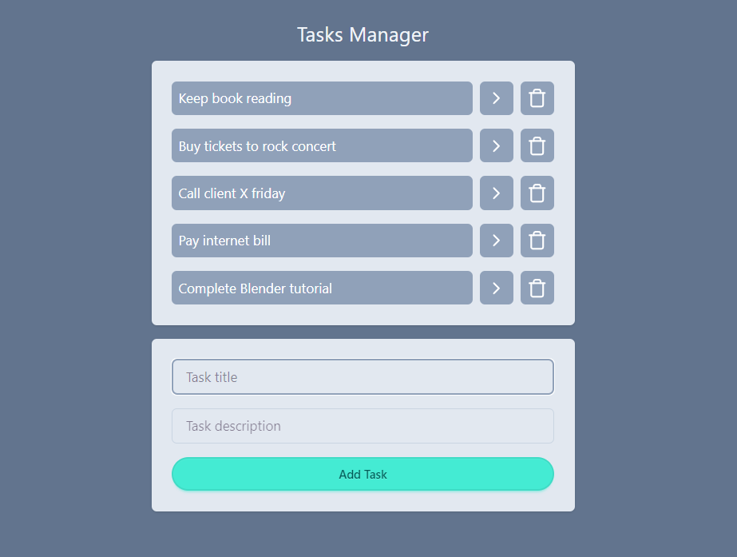

# Todo list

Video tutorial from Felipe Rocha Youtube channel:

Curso de React para Completos Iniciantes [2024]

[Link to video](https://www.youtube.com/watch?v=2RWsLmu8yVc)

[Repository](https://github.com/felipemotarocha/curso-de-react-yt)

Points explored in this tutorial:

Components

Brief overview of class components

Normal functions

Arrow functions

App Deployment to Vercel

Local storage

API fetching data

Brief overview of Tailwindcss